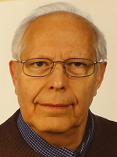

# Dr. Ralf Wessel

 

Physicist (retired, born 1942)    
E-mail: rawessel@gmx.net        
City: Berlin/Germany       

***

### My scientific interests:
 

* Analysis of biological/genetic/proteomic data  

* Programming skills: C++, HTML, FORTRAN,  relational databases (MySQL)  

### My publications:  

* **Not-cited in PubMed:**  <a href="https://RalfWess.github.io/Publi.html" target="_blank"> publications</a> 

* **Cited in PubMed:**  <a href="http://www.ncbi.nlm.nih.gov/pubmed/?term=WESSEL+R  KLEIN + A" target="_blank"> publications</a> 

*** 

### My working places:  

* Central Institute for Molecular Biology, Berlin (1972-1991)  

* Free University Berlin(1991-1994)  

* Max-Delbrueck-Center, Berlin (1994-2007)  

*** 
### My hobbies:  
walking, hiking
